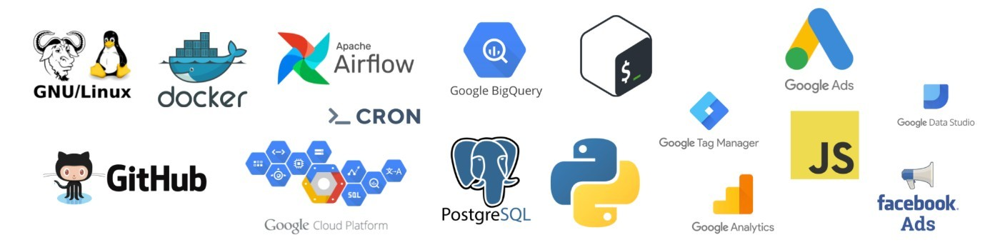

### Hello World

$ `echo` About Me:

  

> Data engineer and analytics engineer, with a good understanding of designing and building data ingestion & data processing pipelines for batch data processing and real-time streaming data analytics. Comfortable working with RDBMS, NoSQL, OLAP, MPP (Massively Parallel Processing data platforms) and ETL frameworks, supported by strong knowledge of data modelling and DWH design.

- 🔭 I’m currently working on developing data solutions using python and sql
- 🌱 I’m currently learning Big Data Engineering Technologies
- 👯 I’m looking to collaborate on data engineering & analytics engineering projects

## Some of my Github Stats

